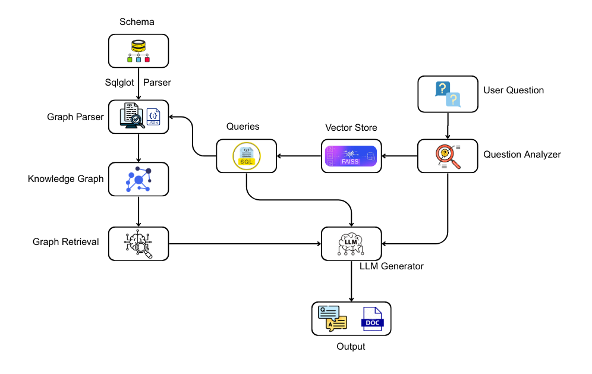
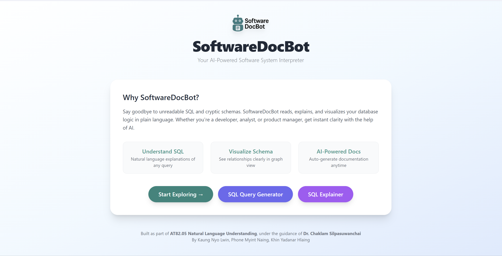
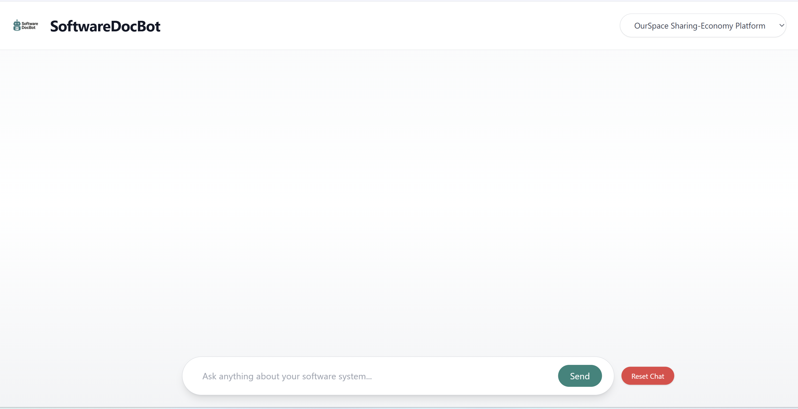
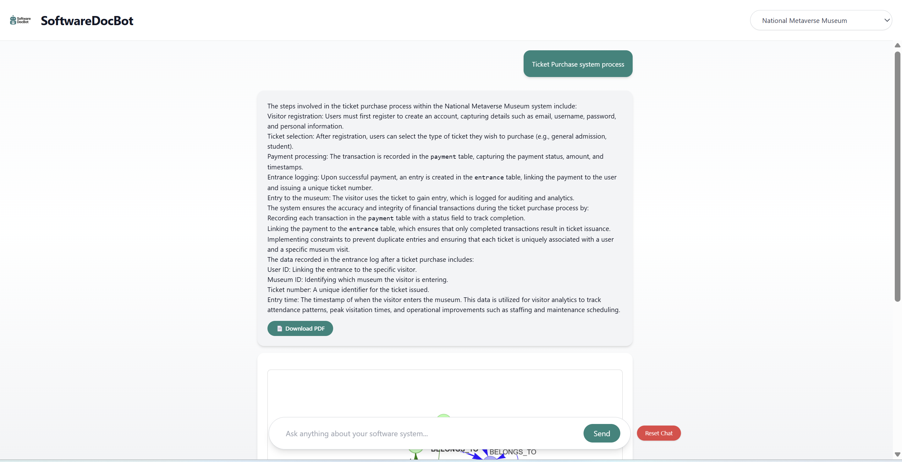
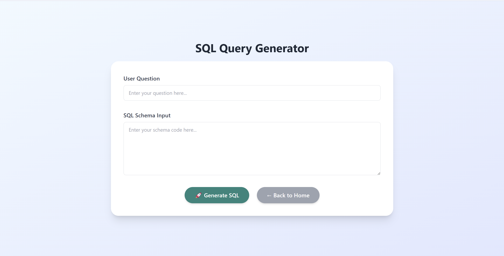
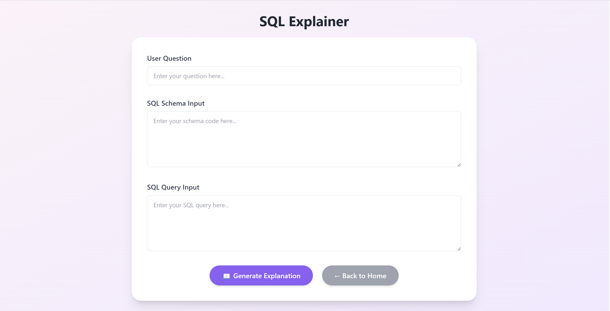

# SoftwareDocBot: Bridging the Gap Between Developers and Business Users  
_A Schema-Aware NLP Assistant for SQL and Software System Documentation_

## Class Project for AT82.05 – Artificial Intelligence: Natural Language Understanding  
**Supervised by:** Asst. Prof. Chaklam Silpasuwanchai  
**Team Name:** Software Intelligence Squad

## Team Members
- **Kaung Nyo Lwin** – Data Science and AI, AIT ([st125066@ait.ac.th](mailto:st125066@ait.ac.th))
- **Phone Myint Naing** – Data Science and AI, AIT ([st124973@ait.ac.th](mailto:st124973@ait.ac.th))
- **Khin Yadanar Hlaing** – Data Science and AI, AIT ([st124959@ait.ac.th](mailto:st124959@ait.ac.th))

##  Abstract

**SoftwareDocBot** is an AI-powered documentation assistant that explains SQL queries and database schema structures in plain, human-readable language. Designed for both developers and business stakeholders, it leverages SQL parsing, knowledge graphs, retrieval-augmented generation (RAG), and fine-tuned language models to deliver contextual explanations of software logic. It also supports interactive Q&A about database behavior—making software systems more transparent, maintainable, and accessible to all levels of users.

##  Project Workflow

##  Problem Statement

Modern software systems depend heavily on complex SQL queries and dynamic schemas. However:
- **Developers** often face unclear or outdated documentation.
- **Business users** struggle to interpret backend logic.
- Traditional documentation focuses on structure, not semantics.
- Miscommunication slows development and onboarding.

##  Project Goals

- Generate business-aligned explanations for SQL and schema logic.
- Bridge technical and non-technical understanding using NLP.
- Support schema-aware documentation with real-time querying.
- Reduce hallucination in LLMs using graph-based schema grounding.

## Scope of the Project

SoftwareDocBot integrates:
- SQL parsing via `sqlglot`
- Knowledge graph construction with `NetworkX`
- Context retrieval through `FAISS`
- Explanation generation using a fine-tuned `TinyLlama-1.1B-Chat` model
- An event-driven, agentic workflow to coordinate parsing, retrieval, generation, and feedback

##  Related Work

Our approach is inspired by key research across semantic parsing, schema reasoning, and language modeling. The **Spider dataset** by Yu et al. (2018) provides a benchmark for complex text-to-SQL tasks, which models like **RAT-SQL** (Wang et al., 2020) have extended through relation-aware encoding of schema elements. However, these models focus on generating SQL from text, while we aim to reverse the pipeline—explaining SQL in natural language.

To strengthen schema reasoning, we draw on graph-based learning methods, such as **COMET** (Bosselut et al., 2019), which generates commonsense explanations from structured triples. Our method similarly constructs schema-aware knowledge graphs and aligns them with SQL behavior. For explanation generation, we follow the **RAG paradigm** (Lewis et al., 2020) to combine LLM generation with retrievable context. Works like **GraphCodeBERT** and **RepoAgent** further show the value of combining graph structure and pre-trained models for documentation.

Finally, we incorporate an **agentic workflow**, a concept proposed in recent LLM literature (Zhuge et al., 2023; Hong et al., 2024), to ensure modular control over execution, quality review, and iterative refinement.

##  Methodology Overview

Our system consists of four major modules:

###  SQL Parser
Extracts query components (tables, columns, joins, filters) using `sqlglot`.

###  Knowledge Graph Construction
Builds two graphs with `NetworkX`:
- **Schema-level**: static structure of the database
- **Query-level**: query interactions with schema nodes

###  Agentic Workflow
Modular, event-driven pipeline coordinating:
- Document embedding
- Question generation
- Retrieval (RAG + KG)
- Explanation synthesis
- Feedback refinement

###  LLM Fine-Tuning
Uses the **Gretel Synthetic Text-to-SQL Dataset** to fine-tune `TinyLlama-1.1B-Chat`, training it to explain queries using structured context and domain-aware prompts.

##  Evaluation Summary

We evaluated SoftwareDocBot using:
- A 50-query test set across SQL complexity levels
- BLEU, ROUGE-L, and METEOR scores
- Baselines: ChatGPT-4o, TinyLlama (pre- and post-fine-tuning)

Result: Our fine-tuned model provided more context-aware and accurate explanations than both baselines in most scenarios.

##  Tech Stack

- `sqlglot`, `NetworkX`, `sentence-transformers`, `FAISS`
- `TinyLlama-1.1B-Chat` (fine-tuned)
- `transformers`, `trl`, `torch`, `fp16` mixed precision

##  Target Users

- **Developers:** Understand legacy SQL quickly  
- **Business Analysts/Product Owners:** Ask questions in plain English  
- **QA/Testers:** Validate backend behavior logically  
- **New Team Members:** Learn software systems faster

##  Web Interface

