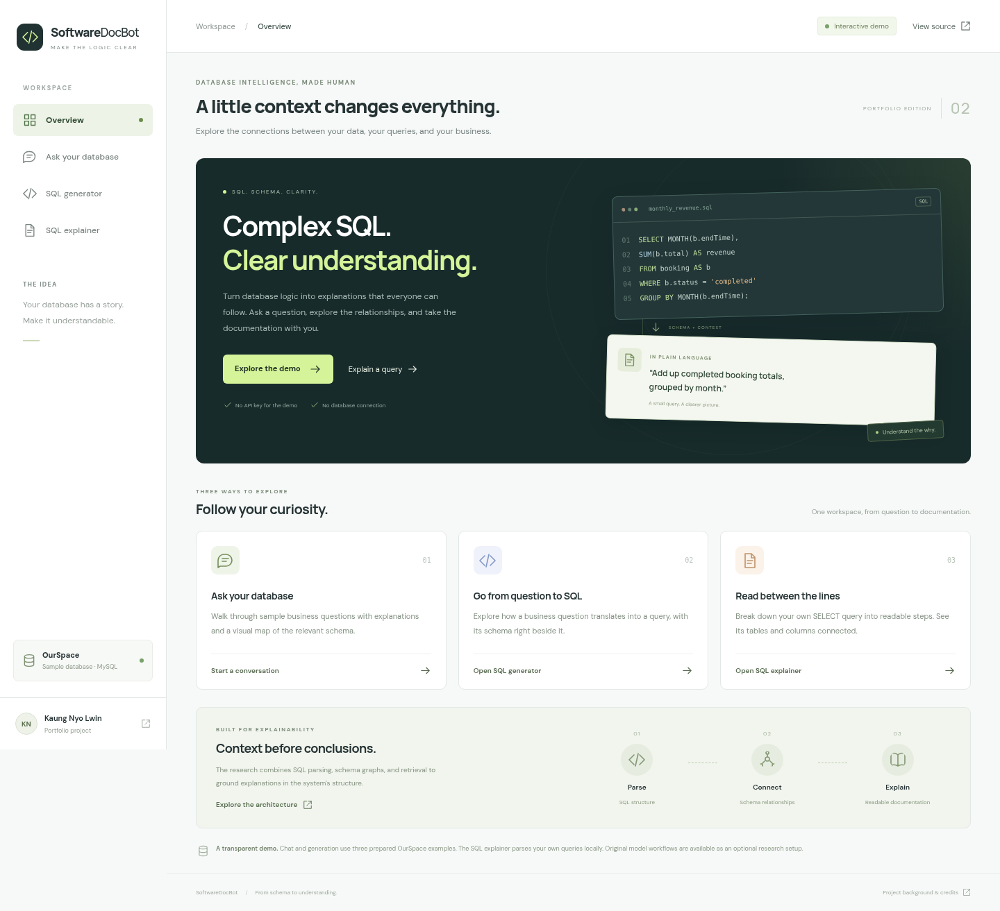
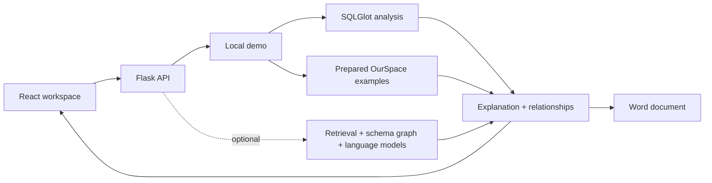

# SoftwareDocBot

**Make database logic understandable.**

A SQL documentation assistant that connects business questions, database schemas, and readable explanations. Explore query relationships, inspect SQL step by step, and export the result as a document.

A portfolio project maintained by **[Kaung Nyo Lwin](https://github.com/Kaung-Nyo-Lwin)**, developed from a collaborative Natural Language Understanding research project at the Asian Institute of Technology.

[Quick start](#quick-start) · [Architecture](docs/ARCHITECTURE.md) · [Research results](docs/RESEARCH.md) · [Original demo recording](https://drive.google.com/file/d/1tPBjoKACIbF4xF4Vv0mB9_JgCbbVjDry/view)



## Why this project

SQL describes what a system does, but the business reasoning is often buried in joins, filters, and stored procedures. SoftwareDocBot explores how structured schema context and retrieval can make that logic easier to explain to developers, analysts, and new team members.

The research combines **SQLGlot**, **NetworkX**, **LlamaIndex**, and language models. The portfolio application adds a lightweight, reproducible way to explore the idea without downloading model weights or buying API credits.

## Try it

| Workspace | Local demo | Optional research mode |
| --- | --- | --- |
| Ask your database | Three prepared walkthroughs with source links and parsed query graphs | Original retrieval and graph workflow with Groq or OpenAI |
| SQL generator | Prepared SQL for the bundled question/schema pairs | Locally fine-tuned T5 checkpoint |
| SQL explainer | Structural analysis of your own MySQL SELECT queries | TinyLlama with the original LoRA adapter |
| Documentation | Unicode Word documents for chat and explanations | Same export interface |

The demo is explicitly labeled in the interface. Sample answers are not presented as live model output. **No database connection is opened and no SQL is executed.**

## Quick start

Use **Python 3.11–3.12** and **Node.js 22.12+**. Run these commands from the repository root:

```bash
python3 -m venv .venv
source .venv/bin/activate
python -m pip install -r requirements-dev.txt
cp .env.example .env
python -m app.backend.app
```

In another terminal:

```bash
cd app/frontend
npm ci
npm run dev
```

Open **http://localhost:5173**. The API runs on port 8000; Vite forwards `/api` requests to it.

1. Open **Ask your database** and select **How is monthly revenue calculated?**
2. Read the explanation, inspect its relationship graph, and download the documentation.
3. Open **SQL explainer**, load an example, and change its filter or aggregation to see the parsed explanation change.

For Windows, activate the environment with `.venv\Scripts\Activate.ps1`. For model checkpoints, environment variables, and troubleshooting, see [setup](docs/SETUP.md).

### Run with Docker

```bash
docker compose up --build
```

Open **http://localhost:8080**. This serves the built frontend and API together in demo mode. [Deployment details](docs/SETUP.md#deployment).

## Engineering decisions

- **An honest, useful demo.** The explainer performs real SQL parsing; chat and SQL generation expose clearly labeled examples when models are unavailable.
- **Lazy model loading.** Starting the API does not load PyTorch, download embeddings, or require model weights.
- **Schema context you can inspect.** Relationship graphs show query, table, and column connections with a text alternative.
- **Predictable API behavior.** Validated JSON inputs, bounded request sizes, useful errors, configurable origins, and unique document filenames.
- **A complete review path.** Backend tests, browser tests, CI, setup documentation, and preserved research artifacts.


```mermaid
flowchart LR
    UI[React workspace] --> API[Flask API]
    API --> Demo[Local demo]
    Demo --> Parser[SQLGlot analysis]
    Demo --> Samples[Prepared OurSpace examples]
    API -. optional .-> Research[Retrieval + schema graph + language models]
    Parser --> Result[Explanation + relationships]
    Samples --> Result
    Research --> Result
    Result --> UI
    Result --> Docs[Word document]
```

## My contribution

My original work focused on the **event-driven agent workflow**, integrating the **OurSpace system context**, preparing **evaluation questions and reference answers**, and documenting the research. These contributions are represented in the repository's commit history, including the [workflow](https://github.com/Kaung-Nyo-Lwin/system_expert_bot/commit/7df1622), [evaluation data](https://github.com/Kaung-Nyo-Lwin/system_expert_bot/commit/319d34d), and [report](https://github.com/Kaung-Nyo-Lwin/system_expert_bot/commit/de26d3e).

This portfolio edition adds the redesigned workspace, a model-free demo, application configuration, document export improvements, automated checks, and practical documentation.

## Research snapshot

The original class report records the following explanation-similarity scores:

| Configuration | BLEU | ROUGE-L | METEOR |
| --- | ---: | ---: | ---: |
| Simple RAG | 0.0979 | 0.2633 | 0.3211 |
| Workflow without graph | 0.1263 | 0.2750 | 0.3284 |
| Complete workflow | 0.1291 | 0.2847 | 0.3318 |
| Complete workflow with trained model | 0.4210 | 0.5407 | 0.5381 |

These are **reported classroom results**, not a reproduced benchmark of the portfolio demo. Text-overlap metrics do not establish factual correctness or production readiness. See the [research notes and limitations](docs/RESEARCH.md) for sources and context.

## Development

```bash
# From the repository root, with the Python environment activated
python -m pytest

# Frontend production build and browser checks
cd app/frontend
npm run build
npx playwright install chromium
npm test
```

Browser tests start the frontend and backend automatically; they expect `.venv` at the repository root. CI runs the same checks using Python 3.12 and Node 22.

```text
app/backend/       Flask API, deterministic SQL analysis, research integrations
app/frontend/      React workspace, visualizations, browser tests
tests/             API, SQL parsing, and document regression tests
docs/              Setup, architecture, research notes, screenshots
R&D/               Original experiments, notebooks, and evaluation data
Documents/         Original LaTeX research report
```

## Current boundaries

The local explainer supports a single MySQL SELECT, including joins, filters, grouping, sorting, and limits. CTEs, nested SELECTs, stored procedures, and writes are outside its current scope. It describes syntax and relationships; it does not verify business intent or execute queries.

The original T5 checkpoint and TinyLlama adapter are **not included**. Live research mode requires additional dependencies and credentials, and has not been validated against a live provider as part of the portfolio refresh.

## Credits

Originally developed for **AT82.05 — Artificial Intelligence: Natural Language Understanding**, Asian Institute of Technology, under **Asst. Prof. Chaklam Silpasuwanchai**.

**Original team:** Kaung Nyo Lwin, Phone Myint Naing, and Khin Yadanar Hlaing (Software Intelligence Squad).

This is Kaung Nyo Lwin's maintained portfolio edition of that team project. Original authorship, commit history, research artifacts, and third-party notices are retained.
