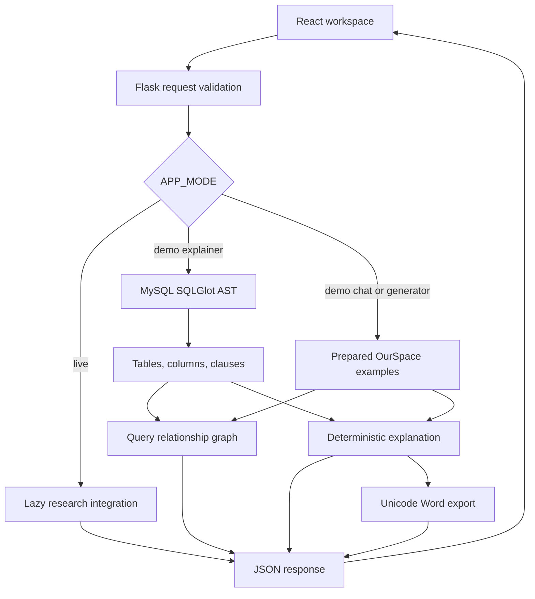
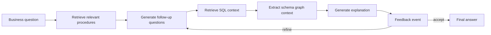

# Architecture

SoftwareDocBot has two execution paths behind the same Flask API. The default path makes the project reproducible on a laptop. The optional path retains the original research integrations.

## Portfolio application

### Frontend

React Router provides an overview, guided chat, SQL generator, and SQL explainer. A shared API client handles errors and timeouts; deployment supplies an optional API origin rather than hard-coded localhost URLs. A shared status context reports API connectivity and the configured mode.

The graph renderer is loaded on demand and destroys its Vis Network instance when unmounted. Nodes can be dragged. A text alternative exposes the relationships without requiring access to the canvas. Markdown is rendered without enabling raw HTML. Forms have labels, keyboard navigation, loading states, and inline errors.

### Local SQL analysis

`app/backend/analysis.py` parses MySQL CREATE TABLE definitions and a single SELECT. It walks the syntax tree to describe joins, filters, selected expressions, grouping, ordering, and limits. The graph links the query to referenced tables and their referenced columns. It represents access and membership, not a full foreign-key or column-lineage model.

The implementation resolves table aliases and unambiguous columns. Ambiguous unqualified columns are not assigned to a table in the graph. Nested SELECTs, CTEs, set operations, stored procedures, and write statements are rejected with an explanatory error. No database driver is installed and no query is executed.

The schema is reduced to table names, column names, and types for demo matching. It does not validate all constraints or prove the query is semantically correct. The business question is context for the user; the deterministic explainer does not judge whether the SQL answers it.

### Prepared examples

`app/backend/examples.json` is the single source for the three sample questions, schemas, queries, and walkthroughs. Chat matches a normalized sample question; generation also checks the schema's tables, columns, and types. Unsupported requests return an explicit 422 response. There is no silent substitution of sample output for failed live model calls.

The samples use a reduced OurSpace schema. The revenue example adapts `sp_MonthlyRevenue`; popularity and customer spending are illustrative queries over the original schema. They are labeled as such in their explanations.

### API

| Method | Endpoint | Purpose |
| --- | --- | --- |
| GET | `/api/health` | Process readiness, configured mode, app version |
| GET | `/api/examples` | Bundled examples |
| POST | `/api/message` | `{ "user_input": "..." }` |
| POST | `/api/generate-sql` | `{ "question": "...", "schema": "..." }` |
| POST | `/api/generate-explanation` | `{ "question": "...", "schema": "...", "query": "..." }` |
| GET | `/api/documents/<filename>` | Download a generated Word document |

Errors use `{ "error": "..." }`. Invalid input returns 400, unsupported demo requests 422, missing optional model configuration 503, and unexpected failures 500 without leaking exception details. Request bodies are limited to 64 KiB and individual required strings to 20,000 characters. Document filenames use UUIDs and exports support Unicode.

## Original research workflow

`agent.py` implements the event workflow with LlamaIndex, sentence embeddings, a persisted vector index, and the NetworkX schema graph. The web adapter accepts the first answer automatically; the original event API supports a human feedback loop. Each HTTP request owns its workflow and graph, preventing cross-user conversation state from being reused.

`sql_model_pipeline.py` contains separate lazy loaders for T5 generation and the TinyLlama adapter. Model loading is outside the default startup path. Checkpoint-dependent and provider-dependent behavior remains an optional, unverified research integration; API boundary tests do not establish model quality.

## Tradeoffs and next steps

- Deterministic parsing makes the demo inspectable and cheap to run, but its explanations are structural and have a deliberately limited SQL scope.
- The research vector index is retained as an original artifact. Rebuilding it with new embeddings would require a controlled re-evaluation.
- Model inference is synchronous at the HTTP boundary. A deployed model service would benefit from a queue, concurrency limits, model warmup, and cancellation.
- Exports need a retention policy and access controls before use with private data on a public host.
- Evaluation should add SQL execution correctness, schema-grounding checks, and human review alongside text-overlap metrics.
